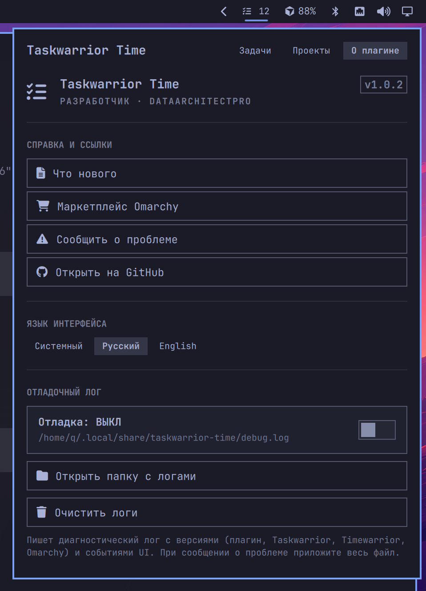

# Taskwarrior Time

[English](README.md) · **Русский**

**Taskwarrior Time** — виджет панели [Omarchy](https://omarchy.org/), который выносит **Taskwarrior** и **Timewarrior** в shell. Создавайте, редактируйте, фильтруйте задачи и учитывайте время, не покидая рабочий стол.

Маркетплейс: [plugins.omarchy.org/plugin.html?id=taskwarrior-time](https://plugins.omarchy.org/plugin.html?id=taskwarrior-time)


## Что это такое

**Taskwarrior Time** (id плагина `taskwarrior-time`) — **графическая надстройка** над привычным консольным стеком задач, а не отдельная база.

| Компонент | Роль |
| --- | --- |
| [Taskwarrior](https://taskwarrior.org/) (`task`) | Источник правды: задачи, проекты, приоритеты, сроки, зависимости, статусы |
| [Timewarrior](https://timewarrior.net/) (`timew`) | Учёт времени: старт/стоп таймеров и итоги за день (желателен, но не обязателен) |
| Omarchy shell | Хост панели: плагин обращается к `task` / `timew` через локальный хелпер |

Всё, что вы делаете в панели, пишется в обычные данные Taskwarrior / Timewarrior. Те же задачи можно вести из терминала (`task`, `timew`) — панель лишь дополняет эти утилиты удобным UI.

## Возможности

- **Список задач** с группировкой (проект, приоритет, срок, статус) и сворачиваемым расширенным фильтром
- **Создание и редактирование** на месте: название, описание, статус (Ожидание / В работе / Готово), «чего ждём», итог, приоритет, проект
- Поля **сроков** (scheduled / due), **зависимости** (depends / blocks) и таймеры **Timewarrior** с ручной корректировкой времени
- Мета в списке: проект · приоритет · срок (Сегодня / Завтра / Просрочено) · блокирована — цвета из темы Omarchy
- Вкладка **Проекты**: просмотр, переименование, очистка проекта у задач
- Диалог **несохранённых изменений** при закрытии черновика (Сохранить / Продолжить / Отменить)
- Единые **горячие клавиши**: `Ctrl+Enter` — сохранить/добавить, `Esc` — отмена, `Ctrl+Delete` — удалить/сбросить
- **Локализация**: английский и русский (системный язык или выбор на вкладке «О плагине»)
- Вкладка **О плагине**: версия, разработчик, GitHub, язык интерфейса и отладочный лог

### Список задач


### Группировка

В панели можно сгруппировать список по проекту, приоритету, сроку или статусу.


### Фильтр и поиск

Раскройте **Фильтр**, чтобы сузить список по статусу, проекту, приоритету, сроку, таймеру и зависимостям, плюс текстовый поиск по описанию.


### Форма новой задачи

Липкий композер внизу раскрывается в ту же раскладку полей, что и редактор: описание, статус, «чего ждём», приоритет, проект; сроки / связи / время — под спойлером.


### Редактор задачи

Клик по задаче открывает редактирование на месте. **Сохранить** при изменениях (`Ctrl+Enter`), **Отмена** (`Esc`) — свернуть, **Удалить** (`Ctrl+Delete`).


### Проекты

Перейдите на вкладку **Проекты**, чтобы увидеть список, переименовать проект, очистить его у всех задач или добавить новый.


## Требования

- [Omarchy](https://omarchy.org/) Linux (Quickshell / система плагинов)
- [Taskwarrior](https://taskwarrior.org/) (`task`) — пакет `task` из репозитория дистрибутива
- [Timewarrior](https://timewarrior.net/) (`timew`) — желателен для таймеров; пакет `timew` из репозитория дистрибутива

Плагин сам системные пакеты не ставит. В Arch Linux пакеты называются `task` и `timew`.

## Установка (Linux / Omarchy)

Предпочтительно — Omarchy сам клонирует и включает плагин:

```bash
omarchy plugin add https://github.com/DataArchitectPro/taskwarrior-time.git --enable --yes
```

Затем поместите виджет на панель, если его ещё нет (установщик может спросить секцию), или вручную:

```bash
omarchy bar move taskwarrior-time --section right
```

Перезапустите shell, если иконка не появилась:

```bash
omarchy restart shell
```

### Checkout для разработки

Для локальной разработки положите или клонируйте этот репозиторий в `~/.config/omarchy/plugins/taskwarrior-time`, затем:

```bash
omarchy plugin enable taskwarrior-time --section right
omarchy restart shell
```

Идентификатор плагина — `taskwarrior-time` (имя папки в `~/.config/omarchy/plugins/`). Отображаемое имя в marketplace — **Taskwarrior Time**.

## Обновление

Если плагин ставили через `omarchy plugin add` (есть git remote):

```bash
omarchy plugin update taskwarrior-time --yes
```

Или вручную:

```bash
git -C ~/.config/omarchy/plugins/taskwarrior-time pull --ff-only
omarchy restart shell
```

Файлы в `~/.config/omarchy/plugins/` подхватываются shell при сохранении; полный перезапуск нужен только если изменения не применились.

## Удаление

```bash
omarchy plugin remove taskwarrior-time
```

Виджет отключается, каталог `~/.config/omarchy/plugins/taskwarrior-time` удаляется. Данные Taskwarrior / Timewarrior не трогаются.

## Использование

1. ЛКМ по иконке Taskwarrior Time на панели — открыть окно.
2. В шапке переключайте **Задачи** / **Проекты**.
3. Раскройте **Фильтр**, если нужны статус / проект / приоритет / срок / таймер / зависимости или поиск.
4. Клик по задаче раскрывает редактор; внизу карточки — **Сохранить**, **Отмена**, **Удалить**.
5. Фокус в композере внизу — создание новой задачи с полной формой.
6. Вкладка **О плагине** в шапке — версия, GitHub и отладочный лог.



## Отладочный лог

Если что-то ведёт себя странно, включите отладку на вкладке **О плагине**.

1. Откройте **О плагине** → включите **Отладку**.
2. Один раз воспроизведите баг (при включении пишется свежий баннер сессии).
3. **Открыть папку с логами** и приложите `~/.local/share/taskwarrior-time/debug.log` к issue.
4. По желанию **Очистить логи** перед чистым захватом, затем снова включите отладку.

В начале файла — короткий человекочитаемый баннер и окружение:

- id / версия плагина
- версии Taskwarrior, Timewarrior и Omarchy (если доступны)
- ОС / рабочий стол / locale / язык UI
- пути к данным и логу

Дальше события идут как **NDJSON** (по одному JSON на строку) с полями `level` (`info` / `warn` / `error`), `component` (`ui` / `helper` / `system`), `event` и `detail`. Длинный текст обрезается — всё равно не прикладывайте секреты и приватное содержимое задач.

Лог только локальный. Когда закончите — выключите отладку.

## Сообщения об ошибках

Если нашли баг, падение, неверное поведение Taskwarrior/Timewarrior или хотите предложить функцию:

1. Посмотрите [существующие issues](https://github.com/DataArchitectPro/taskwarrior-time/issues).
2. Создайте [новый issue](https://github.com/DataArchitectPro/taskwarrior-time/issues/new) и укажите:
   - версию Omarchy / Taskwarrior Time (см. О плагине)
   - шаги воспроизведения
   - ожидаемое и фактическое поведение
   - полный файл `~/.local/share/taskwarrior-time/debug.log` из сессии с включённой отладкой (в баннере уже есть версии зависимостей)

Пожалуйста, **не** прикладывайте секреты, токены и приватное содержимое задач.

## Проверки при разработке

В клоне этого репозитория:

```bash
./scripts/enable-git-hooks   # один раз на клон — включает pre-push
./scripts/check           # validate манифеста + qmllint
```

`git push` прогоняет те же проверки через `.githooks/pre-push` и отменяет push при ошибке. GitHub Actions запускает `./scripts/check` на push и pull request.

## Лицензия

[MIT](LICENSE) — можно свободно использовать, копировать, изменять, объединять, публиковать, распространять, сублицензировать и продавать. Нужно сохранять уведомление об авторских правах.

## Автор

**DataArchitectPro** — [репозиторий на GitHub](https://github.com/DataArchitectPro/taskwarrior-time) · [маркетплейс Omarchy](https://plugins.omarchy.org/plugin.html?id=taskwarrior-time)
